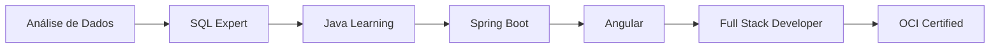

<div align="center">
  
</div>

<div align="center">
  
  
</div>

---

## ☕ Sobre mim

Desenvolvedor **Full Stack** especializado em **Java** e **Angular**, com foco em criar soluções robustas e escaláveis. Combinando a força do backend Java com interfaces modernas em Angular para entregar aplicações completas e de alta qualidade.

- 🎓 **Bacharelando** em Ciência da Computação - UNIP (2023-2026)
- ☕ **Especialização**: Java, Spring Boot, Angular, TypeScript
- 🏆 **Certificado**: Oracle Cloud Infrastructure (OCI) Foundations Associate
- 💼 **Experiência**: +1 ano trabalhando com SQL/Oracle e desenvolvimento
- 📍 **Localização**: Boituva, SP
- 🎯 **Objetivo**: Desenvolvedor Full Stack Java + Angular

## 🏆 Certificações


## 🛠️ Stack Tecnológica

### **☕ Backend Java**


### **🅰️ Frontend Angular**


### **🗄️ Banco de Dados**


### **☁️ Cloud & DevOps**


## 💡 Skills & Competências

```java
public class JhordanBandeira {
    
    // ☕ Backend Java Skills
    private String[] javaBackend = {
        "Java 8+", "Spring Boot", "Spring MVC", "Spring Security",
        "JPA/Hibernate", "REST APIs", "Maven", "Microserviços",
        "Design Patterns", "SOLID Principles"
    };
    
    // 🅰️ Frontend Angular Skills
    private String[] angularFrontend = {
        "Angular 15+", "TypeScript", "RxJS", "Angular Material",
        "Component Architecture", "Services & Dependency Injection",
        "Routing & Guards", "HTTP Client", "Reactive Forms"
    };
    
    // 🗄️ Database & Cloud
    private String[] databaseCloud = {
        "Oracle Database", "SQL Avançado", "PL/SQL",
        "Oracle Cloud Infrastructure (OCI)", "Cloud Architecture"
    };
    
    // 🔧 Tools & Practices
    private String[] toolsPractices = {
        "Git/GitHub", "Docker", "Clean Code", "Agile/Scrum",
        "API Design", "Test-Driven Development"
    };
}
```

## 📈 Minha Jornada



## 🎯 Projetos em Destaque

### ☕🅰️ Projetos Full Stack Java + Angular
- **Sistema de Gestão** - CRUD completo com Spring Boot + Angular
- **API REST** - Backend Java com Spring Boot e documentação Swagger
- **Dashboard Angular** - Interface moderna com Angular Material
- **Autenticação JWT** - Sistema seguro com Spring Security + Angular Guards

### ☕ Projetos Backend Java
- **Microserviços** - Arquitetura distribuída com Spring Cloud
- **API RESTful** - Endpoints documentados e testados
- **Integração com Banco** - JPA/Hibernate e queries otimizadas

### 🗄️ Projetos Database & Cloud
- **Oracle Cloud** - Deploy e configuração de aplicações na OCI
- **Queries Otimizadas** - SQL avançado e PL/SQL

## 📊 GitHub Stats

<div align="center">
  
  
</div>

<div align="center">
  
</div>

## 🚀 Objetivos 2025

- [x] **Certificação OCI**: Oracle Cloud Infrastructure Foundations Associate
- [ ] **Projeto Full Stack**: Sistema completo Java + Angular em produção
- [ ] **Microserviços**: Arquitetura distribuída com Spring Cloud
- [ ] **Deploy Cloud**: Aplicações na Oracle Cloud Infrastructure
- [ ] **Contribuições Open Source**: Projetos Java/Angular na comunidade
- [ ] **Vaga Full Stack**: Desenvolvedor Java + Angular Pleno

## 🎓 Aprendizado Contínuo

> "☕ Java no backend, Angular no frontend, código de qualidade em ambos"

**Atualmente estudando:**
- ☕ **Java Avançado**: Streams, Lambda, Concorrência, Design Patterns
- 🍃 **Spring Ecosystem**: Spring Cloud, Spring Data, Spring Security
- 🅰️ **Angular Avançado**: State Management, Performance, Testing
- ☁️ **Oracle Cloud**: OCI Services, Container Engine, Functions
- 🐳 **DevOps**: Docker, CI/CD, Kubernetes
- 📚 **Arquitetura**: Clean Architecture, DDD, Microserviços

## 🌐 Conecte-se comigo

[](https://www.linkedin.com/in/jhordan-bandeira)
[](mailto:jhordanbandeira1@gmail.com)
[](https://wa.me/5515992509779)

---

<div align="center">

### "☕ Java + Angular = Soluções Completas" 🚀

⭐ **Obrigado pela visita! Explore meus repositórios e vamos codar juntos!** ⭐


</div>
