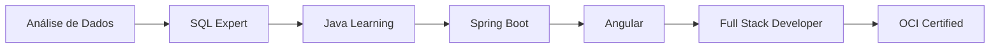

<div align="center">

# 👋 Olá, eu sou Jhordan Bandeira

### Desenvolvedor Full Stack | Java ☕ | Angular 🅰️

[](https://www.java.com/)
[](https://angular.io/)
[](https://spring.io/projects/spring-boot)
[](https://www.oracle.com/cloud/)

</div>

---

## 👨‍💻 Sobre Mim

Desenvolvedor **Full Stack** especializado em **Java** e **Angular**, dedicado a criar soluções robustas, escaláveis e de alta qualidade. Combino a força do ecossistema Java no backend com interfaces modernas e responsivas em Angular, entregando aplicações completas que atendem às necessidades do mercado.

### 📋 Informações Profissionais

| Item | Detalhes |
|------|----------|
| 🎓 **Formação** | Bacharelando em Ciência da Computação - UNIP (2023-2026) |
| ☕ **Especialização** | Java, Spring Boot, Angular, TypeScript |
| 🏆 **Certificação** | Oracle Cloud Infrastructure (OCI) Foundations Associate |
| 💼 **Experiência** | +1 ano em desenvolvimento e SQL/Oracle |
| 📍 **Localização** | Boituva, SP - Brasil |
| 🎯 **Objetivo** | Desenvolvedor Full Stack Java + Angular |

---

## 🏆 Certificações

<div align="center">


</div>

---

## 🛠️ Tecnologias e Ferramentas

### ☕ Backend

<div align="left">


</div>

### 🅰️ Frontend

<div align="left">


</div>

### 🗄️ Banco de Dados

<div align="left">


</div>

### ☁️ Cloud & DevOps

<div align="left">


</div>

---

## 💡 Competências Técnicas

```java
public class JhordanBandeira {
    
    // ☕ Backend Java
    private String[] backendSkills = {
        "Java 8+", "Spring Boot", "Spring MVC", "Spring Security",
        "JPA/Hibernate", "REST APIs", "Maven", "Microserviços",
        "Design Patterns", "SOLID Principles", "Clean Code"
    };
    
    // 🅰️ Frontend Angular
    private String[] frontendSkills = {
        "Angular 15+", "TypeScript", "RxJS", "Angular Material",
        "Component Architecture", "Services & Dependency Injection",
        "Routing & Guards", "HTTP Client", "Reactive Forms"
    };
    
    // 🗄️ Database & Cloud
    private String[] databaseCloud = {
        "Oracle Database", "SQL Avançado", "PL/SQL",
        "Oracle Cloud Infrastructure (OCI)", "Cloud Architecture"
    };
    
    // 🔧 Tools & Practices
    private String[] toolsPractices = {
        "Git/GitHub", "Docker", "Agile/Scrum",
        "API Design", "Test-Driven Development", "CI/CD"
    };
}
```

---

## 📈 Jornada Profissional



---

## 🎯 Projetos em Destaque

### ☕🅰️ Full Stack Java + Angular

- **Sistema de Gestão Completo** - CRUD completo com Spring Boot + Angular, autenticação JWT e dashboard interativo
- **API REST Documentada** - Backend Java com Spring Boot, documentação Swagger e testes automatizados
- **Dashboard Angular** - Interface moderna com Angular Material, gráficos interativos e responsividade
- **Sistema de Autenticação** - Implementação segura com Spring Security + Angular Guards e refresh tokens

### ☕ Backend Java

- **Arquitetura de Microserviços** - Sistema distribuído com Spring Cloud, service discovery e API Gateway
- **API RESTful** - Endpoints documentados, versionamento de API e tratamento de erros padronizado
- **Integração com Banco de Dados** - JPA/Hibernate, queries otimizadas e transações gerenciadas

### 🗄️ Database & Cloud

- **Deploy na Oracle Cloud** - Configuração e deploy de aplicações na OCI com containerização
- **Otimização de Queries** - SQL avançado, PL/SQL e análise de performance de banco de dados

---

## 📊 Estatísticas do GitHub

<div align="center">


</div>

---

## 🚀 Objetivos 2025

- [x] **Certificação OCI** - Oracle Cloud Infrastructure Foundations Associate
- [ ] **Projeto Full Stack em Produção** - Sistema completo Java + Angular deployado
- [ ] **Arquitetura de Microserviços** - Implementação com Spring Cloud
- [ ] **Deploy na Cloud** - Aplicações rodando na Oracle Cloud Infrastructure
- [ ] **Contribuições Open Source** - Participação ativa em projetos Java/Angular
- [ ] **Evolução Profissional** - Desenvolvedor Full Stack Java + Angular Pleno

---

## 🎓 Aprendizado Contínuo

> *"☕ Java no backend, Angular no frontend, código de qualidade em ambos"*

### 📚 Em Estudo

- ☕ **Java Avançado** - Streams, Lambda, Concorrência, Design Patterns
- 🍃 **Spring Ecosystem** - Spring Cloud, Spring Data, Spring Security Avançado
- 🅰️ **Angular Avançado** - State Management, Performance Optimization, Testing
- ☁️ **Oracle Cloud** - OCI Services, Container Engine, Serverless Functions
- 🐳 **DevOps** - Docker, CI/CD Pipelines, Kubernetes
- 📚 **Arquitetura** - Clean Architecture, DDD, Microserviços Patterns

---

## 🌐 Contato

<div align="center">

[](https://www.linkedin.com/in/jhordan-bandeira)
[](mailto:jhordanbandeira1@gmail.com)
[](https://wa.me/5515992509779)
[](https://github.com/devBandeiraa)

</div>

---

<div align="center">

### 💼 "☕ Java + Angular = Soluções Completas" 🚀

⭐ **Obrigado pela visita! Explore meus repositórios e vamos codar juntos!** ⭐

---


</div>
