<!-- PERFIL · Jhordan Gabriel Bandeira · github.com/devBandeiraa -->

<div align="center">


<br/>

<a href="https://www.linkedin.com/in/jhordan-bandeira"></a>
<a href="mailto:jhordanbandeira1@gmail.com"></a>

</div>


## `> whoami`

```java
public class Jhordan {

    String cargo       = "Desenvolvedor Backend Júnior";
    String local       = "Boituva, SP · remoto, híbrido ou presencial (Sorocaba e região)";
    String formacao    = "Ciência da Computação · UNIP · dez/2026";
    int    experiencia = 2; // anos: e-commerce em produção + dados corporativos

    List<String> foco = List.of(
        "Java e Spring Boot",
        "concorrência e consistência entre microsserviços",
        "testes de integração com infraestrutura real"
    );

    String abordagem() {
        return "entender a arquitetura antes de mexer no código, "
             + "e seguir o problema até a causa, não só o sintoma";
    }
}
```


## `> projeto em destaque`

### 🎫 [ticket-platform](https://github.com/devBandeiraa/ticket-platform)

**Venda de ingressos em microsserviços, sem vender o mesmo assento duas vezes.**

- 🔒 Garantia no PostgreSQL: `UPDATE` condicional + `CHECK constraint`. O lock em Redis é só otimização
- 🧪 **356 testes** com PostgreSQL, Redis e RabbitMQ reais via Testcontainers, com **200 threads** disputando o mesmo estoque
- 📬 Transactional outbox, idempotência, DLQ, circuit breaker e retry com jitter
- 📈 Traces com OpenTelemetry e painéis Prometheus/Grafana
- ⚙️ CI no GitHub Actions · 89% de cobertura

<div align="center">



</div>


## `> outros projetos`

<div align="center">

<a href="https://github.com/devBandeiraa/ticket-platform"></a>
<a href="https://github.com/devBandeiraa/hash-financeiro"></a>
<a href="https://github.com/devBandeiraa/flexauction-platform"></a>
<a href="https://github.com/devBandeiraa/help-desk"></a>

</div>

| Projeto | O que é | Stack |
|---|---|---|
| 💰 **Hash Financeiro** | Gestor financeiro com agente de IA e servidor MCP próprio com OAuth | TanStack Start · Supabase · MCP |
| 🛰️ **FlexAuction** | SaaS para casas de leilão com lances em tempo real via WebSocket | Node.js · TypeScript · React · Prisma |
| 🎟️ **Help Desk Pro** | Sistema de chamados com JWT, RBAC e dashboard analítico | Node.js · TypeScript · React · Prisma |


## `> stack`

<div align="center">


<br/>


</div>

```yaml
backend:        [Java 17, Spring Boot 3, Spring Data JPA, Hibernate, Spring Security/JWT, Spring Cloud Gateway, Node.js]
arquitetura:    [APIs RESTful, Microsserviços, Transactional Outbox, Idempotência, Resilience4j, OpenAPI]
dados:          [PostgreSQL, Oracle, SQL Server, Redis, RabbitMQ, Flyway, Azure Data Factory]
testes:         [JUnit 5, Mockito, Testcontainers, JaCoCo]
devops:         [Docker, Docker Compose, Kubernetes, GitHub Actions, OpenTelemetry, Prometheus, Grafana]
tambem:         [React, TypeScript, Salesforce Commerce Cloud, Claude Code, MCP]
cloud:          [OCI 2025 Foundations Associate]
```


## `> stats`

<div align="center">


<br/>


<br/>

<picture>
  <source media="(prefers-color-scheme: dark)" srcset="https://raw.githubusercontent.com/devBandeiraa/devBandeiraa/output/github-contribution-grid-snake-dark.svg"/>
  
</picture>

</div>


## `> git log --experiencia`

<details>
<summary>📂 &nbsp;<b>Experiência Profissional</b> &nbsp;—&nbsp; <i>clique para expandir</i></summary>

<br/>

### Desenvolvedor Backend Júnior — Backlgrs
`jan/2026 – jun/2026` · Remoto · Sustentação e evolução de e-commerce B2C em Salesforce Commerce Cloud (SFCC)

- Mais de **15 incidentes por semana** em produção, distribuídos entre **cinco projetos simultâneos**, rastreando o pedido entre plataforma, ERP e gateway até o ponto de falha, com correção validada em sandbox antes do deploy
- Integrações com ERP, hub de marketplaces (Anymarket), plataforma de frete (Intelipost) e gateway Braspag, cobrindo Pix, cartão e parcelamento
- Automação de jobs de sincronização de pedidos, pagamentos e estoque com o ERP
- Funcionalidades e correções no back-end (JavaScript/SFRA e Node.js), validações de checkout e correção de timezone em pedidos
- Migração do front-end de Bootstrap 4 para 5 sem impacto na navegação
- Pull requests, code review e Scrum via Jira, com Claude Code e Cursor no debugging e na refatoração

### Desenvolvedor de Software, Dados e Integrações (Estágio) — Guardian RH
`jul/2024 – jan/2026` · Remoto · Dados corporativos com TOTVS RM, Protheus e SAP

- Consultas SQL em Oracle e SQL Server (joins complexos, subqueries, procedures, funções analíticas) para grandes volumes de dados
- Diagnóstico de queries com resultado incorreto ou gargalo de performance
- Pipelines de ETL com Azure Data Factory para migração de dados entre sistemas
- Suporte técnico em dados, relatórios e integrações; dashboards e documentação de rotinas

</details>

<details>
<summary>🌐 &nbsp;<b>Idiomas</b> &nbsp;—&nbsp; <i>clique para expandir</i></summary>

<br/>

- **Português:** nativo
- **Inglês:** intermediário (leitura de documentação técnica e comunicação escrita)

</details>

<br/>

<div align="center">


</div>
