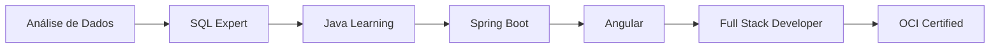

<div align="center">

# 👋 Olá, eu sou Jhordan Bandeira

### `Desenvolvedor Full Stack` | `Java ☕` | `Angular 🅰️`

```java
public class Developer {
    private String name = "Jhordan Bandeira";
    private String role = "Full Stack Developer";
    private String[] stack = {"Java", "Spring Boot", "Angular", "TypeScript"};
    private String certification = "OCI Foundations Associate";
}
```

[](https://www.java.com/)
[](https://angular.io/)
[](https://spring.io/projects/spring-boot)
[](https://www.oracle.com/cloud/)


</div>

---

## 👨‍💻 Sobre Mim

```typescript
interface Developer {
  name: string;
  role: "Full Stack Developer";
  specialization: {
    backend: ["Java", "Spring Boot", "Spring Security"];
    frontend: ["Angular", "TypeScript", "RxJS"];
    database: ["Oracle", "MySQL", "PostgreSQL"];
    cloud: ["Oracle Cloud Infrastructure"];
  };
  experience: "1+ years";
  education: "Bacharelando em Ciência da Computação - UNIP (2023-2026)";
  certification: "OCI Foundations Associate";
  location: "Boituva, SP - Brasil";
}
```

Desenvolvedor **Full Stack** especializado em **Java** e **Angular**, dedicado a criar soluções robustas, escaláveis e de alta qualidade. Combino a força do ecossistema Java no backend com interfaces modernas e responsivas em Angular, entregando aplicações completas que atendem às necessidades do mercado.

---

## 🏆 Certificações

<div align="center">

[](https://www.oracle.com/cloud/certification/)

</div>

---

## 🛠️ Stack Tecnológica

### ☕ Backend

<div align="center">


</div>

### 🅰️ Frontend

<div align="center">


</div>

### 🗄️ Banco de Dados

<div align="center">


</div>

### ☁️ Cloud & DevOps

<div align="center">


</div>

---

## 💡 Competências Técnicas

```java
public class JhordanBandeira {
    
    // ☕ Backend Java
    private String[] backendSkills = {
        "Java 8+", "Spring Boot", "Spring MVC", "Spring Security",
        "JPA/Hibernate", "REST APIs", "Maven", "Microserviços",
        "Design Patterns", "SOLID Principles", "Clean Code"
    };
    
    // 🅰️ Frontend Angular
    private String[] frontendSkills = {
        "Angular 15+", "TypeScript", "RxJS", "Angular Material",
        "Component Architecture", "Services & Dependency Injection",
        "Routing & Guards", "HTTP Client", "Reactive Forms"
    };
    
    // 🗄️ Database & Cloud
    private String[] databaseCloud = {
        "Oracle Database", "SQL Avançado", "PL/SQL",
        "Oracle Cloud Infrastructure (OCI)", "Cloud Architecture"
    };
    
    // 🔧 Tools & Practices
    private String[] toolsPractices = {
        "Git/GitHub", "Docker", "Agile/Scrum",
        "API Design", "Test-Driven Development", "CI/CD"
    };
}
```

---

## 📈 Jornada Profissional



---

## 🎯 Projetos em Destaque

### ☕🅰️ Full Stack Java + Angular

<table>
<tr>
<td width="50%">

#### 🚀 Sistema de Gestão Completo
**Stack:** Spring Boot + Angular + JWT

- ✅ CRUD completo com validações
- ✅ Autenticação JWT segura
- ✅ Dashboard interativo com gráficos
- ✅ API REST documentada com Swagger
- ✅ Responsive design

</td>
<td width="50%">

#### 📊 API REST Documentada
**Stack:** Spring Boot + Swagger + JUnit

- ✅ Endpoints RESTful completos
- ✅ Documentação Swagger/OpenAPI
- ✅ Testes automatizados (JUnit)
- ✅ Tratamento de erros padronizado
- ✅ Versionamento de API

</td>
</tr>
<tr>
<td width="50%">

#### 🎨 Dashboard Angular
**Stack:** Angular + Material + RxJS

- ✅ Interface moderna com Angular Material
- ✅ Gráficos interativos (Chart.js)
- ✅ Reactive Forms avançados
- ✅ State Management com RxJS
- ✅ PWA ready

</td>
<td width="50%">

#### 🔐 Sistema de Autenticação
**Stack:** Spring Security + Angular Guards

- ✅ Autenticação JWT completa
- ✅ Refresh tokens
- ✅ Guards e interceptors
- ✅ Role-based access control
- ✅ Proteção de rotas

</td>
</tr>
</table>

### ☕ Backend Java

<table>
<tr>
<td width="50%">

#### 🌐 Arquitetura de Microserviços
**Stack:** Spring Cloud + Eureka + Gateway

- ✅ Service discovery (Eureka)
- ✅ API Gateway configurado
- ✅ Circuit breaker pattern
- ✅ Config server centralizado
- ✅ Load balancing

</td>
<td width="50%">

#### 🗄️ Integração com Banco de Dados
**Stack:** JPA/Hibernate + Oracle

- ✅ Mapeamento ORM otimizado
- ✅ Queries nativas e JPQL
- ✅ Transações gerenciadas
- ✅ Connection pooling
- ✅ Migrations com Flyway

</td>
</tr>
</table>

### ☁️ Cloud & Database

<table>
<tr>
<td width="50%">

#### ☁️ Deploy na Oracle Cloud
**Stack:** OCI + Docker + CI/CD

- ✅ Containerização com Docker
- ✅ Deploy automatizado na OCI
- ✅ Configuração de ambientes
- ✅ Monitoramento e logs
- ✅ Auto-scaling configurado

</td>
<td width="50%">

#### ⚡ Otimização de Queries
**Stack:** Oracle + PL/SQL + Performance

- ✅ SQL avançado e otimizado
- ✅ Stored procedures (PL/SQL)
- ✅ Análise de performance
- ✅ Índices estratégicos
- ✅ Query tuning

</td>
</tr>
</table>

---

## 📊 Estatísticas do GitHub

<div align="center">

<a href="https://github.com/devBandeiraa">
  
  
</a>

<a href="https://github.com/devBandeiraa">
  
</a>

</div>

---

## 🎓 Aprendizado Contínuo

> *"☕ Java no backend, Angular no frontend, código de qualidade em ambos"*

### 📚 Em Estudo

<div align="center">

| Backend | Frontend | Cloud & DevOps | Arquitetura |
|---------|----------|----------------|-------------|
| ☕ Java Avançado | 🅰️ Angular Avançado | ☁️ Oracle Cloud | 📚 Clean Architecture |
| 🍃 Spring Ecosystem | 📱 State Management | 🐳 Docker & Kubernetes | 🏗️ DDD |
| 🔒 Spring Security | ⚡ Performance | 🔄 CI/CD Pipelines | 🌐 Microserviços |

</div>

---

## 🌐 Contato

<div align="center">

[](https://www.linkedin.com/in/jhordan-bandeira)
[](mailto:jhordanbandeira1@gmail.com)
[](https://wa.me/5515992509779)
[](https://github.com/devBandeiraa)

</div>

---

<div align="center">

### 💼 `"☕ Java + Angular = Soluções Completas"` 🚀

```java
System.out.println("⭐ Obrigado pela visita! Explore meus repositórios e vamos codar juntos! ⭐");
```

---


**Feito com ☕ e 🅰️**

</div>
