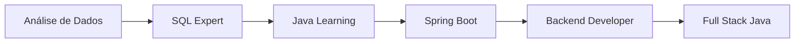

# Olá! Eu sou Jhordan Bandeira 👋

## 🚀 Sobre mim

Sou estudante de **Ciência da Computação** com paixão por tecnologia e desenvolvimento backend. Atualmente em transição de **Análise de Dados** para **Desenvolvimento Java**, combinando minha experiência sólida em dados com o poder do ecossistema Java.

- 🎓 **Bacharelando** em Ciência da Computação - UNIP (2023-2026)
- 🌱 **Estudando ativamente**: Java, Spring Boot, APIs REST, Microserviços
- 💼 **Experiência**: +1 ano trabalhando com SQL/Oracle e análise de dados
- 📍 **Localização**: Boituva, SP
- 🎯 **Objetivo**: Desenvolvedor Backend Java Júnior

## 🛠️ Stack Tecnológica

### **Backend Java (Estudando)**


### **Banco de Dados & Data**


### **Ferramentas & Outras Tecnologias**


## 💡 Skills & Competências

```java
public class JhordanBandeira {
    
    // Skills Técnicas Consolidadas
    private String[] dataSkills = {
        "SQL Avançado", "Oracle Database", "ETL", 
        "Análise de Dados", "Power BI", "Python (Pandas, NumPy)"
    };
    
    // Skills Java em Aprendizado
    private String[] javaSkills = {
        "Java Básico", "POO", "Collections", "Fundamentos Spring",
        "Conceitos REST", "Maven Básico", "Git/GitHub"
    };
    
    // Conceitos que domino
    private String[] concepts = {
        "Clean Code", "SOLID Principles", 
        "Database Design", "Agile Methodologies"
    };
}
```

## 📈 Minha Jornada



## 🎯 Projetos em Destaque

### 🌱 Projetos de Estudo Java
- **Primeiros Passos Java** - Exercícios básicos e POO
- **Sistema Simples** - CRUD básico para praticar
- **Mini API** - Primeiro projeto com Spring Boot

### 📊 Projetos de Dados (Consolidados)
- **Dashboards Executivos** - Power BI com dados Oracle
- **Análises Preditivas** - Python + SQL
- **Automação ETL** - Azure Data Factory

## 📊 GitHub Stats

<div align="center">
  
  
</div>

<div align="center">
  
</div>

## 🚀 Objetivos 2025

- [ ] **Fundamentos Java**: Completar curso básico + 20 exercícios
- [ ] **Primeiro CRUD**: Sistema simples de cadastro
- [ ] **Spring Boot Básico**: Primeira API REST funcional
- [ ] **Projeto Portfolio**: Sistema completo para mostrar skills
- [ ] **Primeira Vaga**: Desenvolvedor Backend Java Júnior

## 🎓 Aprendizado Contínuo

> "Transformando dados em soluções, um commit por vez"

**Atualmente estudando:**
- ☕ Java Fundamentos (Sintaxe, POO, Collections)
- 🍃 Introdução ao Spring Framework
- 📊 Conceitos de banco de dados com Java
- 🔧 Git/GitHub para versionamento
- 📚 Algoritmos e estruturas de dados

## 🌐 Conecte-se comigo

[](https://www.linkedin.com/in/jhordan-bandeira)
[](mailto:jhordanbandeira1@gmail.com)
[](https://wa.me/5515992509779)

---

<div align="center">

### "Dados me trouxeram aqui, Java me levará adiante" 🚀

⭐ **Obrigado pela visita! Explore meus repositórios e vamos codar juntos!** ⭐

</div>
